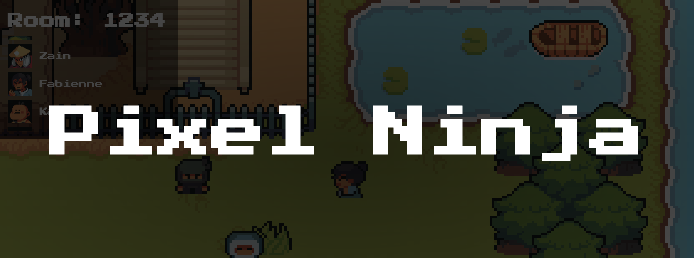
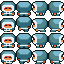
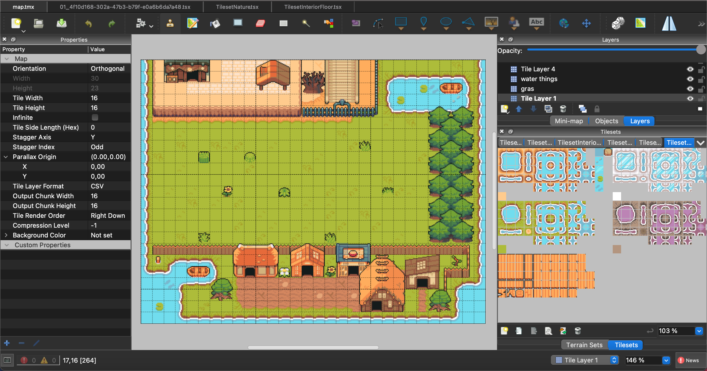
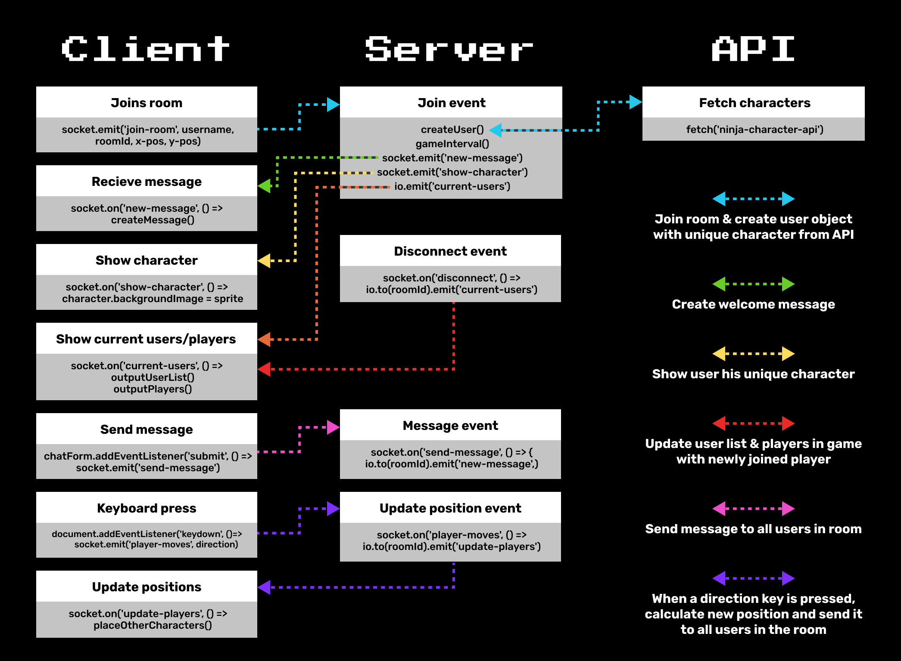

# 🥷 Pixel Ninja

Pixel Ninja is een multiplayer pixelart spel met ninja's als karakters. Na het deelnemen aan een room kun je de wereld ontdekken en chatten met andere spelers.

## 📋 Table of contents

-   [Live demo](#🌐-live-demo)
-   [How to install](#🔧-how-to-install)
-   [Features](#🛠-features)
-   [Hoe is het gemaakt](#🤔-hoe-is-het-gemaakt)
-   [Data life cycle](#📊-data-life-cycle)
-   [API's](#🗄️-apis)
-   [To do's](#✅-to-dos)
-   [Packages](#🌐-npm-packages)
-   [Resources](#🧱-resources)
-   [License](#🔏-license)

## 🌐 Live demo

Probeer de applicatie zelf uit op: https://pixel-ninja.herokuapp.com/

## 🔧 How to install

Clone deze repository naar de gewenste locatie met het volgende commando in je terminal:

```
git clone https://github.com/MarkvHeusden/pixel-ninja.git
```

Navigeer naar de map en installeer vervolgens de packages met het commando:

```js
npm install
```

En start vervolgens de lokale server met het commando:

```
npm start
```

✅ Je kunt de server nu bekijken op http://localhost:3002

## 🛠 Features

-   Eigen rooms aanmaken & joinen
-   Unieke karakters voor iedere speler in een room (tot 12 spelers)
-   Chatten met spelers in je room
-   Pixel wereld verkennen met spelers in je room

## 🤔 Hoe is het gemaakt

Als eerst heb ik een applicatie gemaakt waarbij gebruikers door middel van sockets in verschillende rooms konden komen. Hier heb ik een chat functionaliteit aan gekoppeld, en ik heb een startscherm gemaakt waar de gebruikers het room ID kunnen invullen en een naam kunnen invullen die vervolgens opgeslagen wordt in local storage. Vervolgens had ik een API hieraan gekoppeld die unieke karakters voor iedere gebruiker genereerde (https://avatars.dicebear.com/)

### 🧠 Inspiratie

Hierna wilde ik een game toevoegen die de room samen kan spelen. [Dit voorbeeld](https://medium.com/bluecadet/just-enough-multiplayer-a-simple-start-for-prototyping-realtime-multi-user-spaces-with-socket-io-1fd260ef3e54) gaf mij inspiratie om een multiplayer wereld te maken waar de spelers in kunnen rondlopen. Dit leek mij in eerste instantie wel te doen.

### 👾 Game characters

Ik koos ervoor een top down pixelart spel te maken. Hiervoor had ik karakters nodig die rond kunnen lopen. Ik besloot de vorige API weg te doen en er zelf 1 te maken, met gebruik van spritesheets uit een asset pack die ik had gedownload (zie bronnen). Uit deze asset pack koos ik een paar karakters die bij mijn spel passen. Van elk karakter gebruik ik een 'faceset' en een 'spritesheet'. De faceset is de avatar die je naast de naam ziet in het spel, en de spritesheet een afbeelding met alle states van dat karakter. Door in CSS telkens maar een deel van dit spritesheet te laten zien kun je karakters animeren en verschillende kanten op laten lopen. Hieronder zie je een faceset met de bijbehorende spritesheet

<p float="left">


</p>

Hier zien de afbeeldingen er wazig uit, omdat de karakters maar 16 x 16 pixels groot zijn. Het standaard gedrag van browsers bij het vergroten van deze afbeeldingen is om ze wazig te maken zodat je individuele pixels niet ziet. Voor pixelart wil je de pixels juist wel zien, dus kun je in CSS dit aanpassen door `image-rendering: pixelated;` toe te voegen. Nu heb je een hele kleine afbeelding van 16 x 16 die uitvergroot kan worden op grote schermen.

### 🗺️ Map

Nadat de karakters gefixt waren had ik een map nodig. Hiervoor heb ik hetzelfde asset pack gebruikt als voor de karakters. In dit asset pack zaten ook verschillende tilesets. Door middel van een programma genaamd 'Tiled' heb ik ik een map hierin gemaakt.


### 🎥 Camera en karakter logica

Voor het werkend maken van de game logica met een camera die je volgt heb ik een tutorial voor top down games gevolgd (zie bronnen). Dit was echter single player en werkte nog niet met mijn karakters en mijn map door de afwijkende afmetingen. Nadat alles voor 1 persoon werkte ging ik het multiplayer maken.

### 🥈 Eerst versie: client side

Dit multiplayer maken was echter veel moeilijker dan gedacht. Ik kon hier geen goede tutorial van vinden. Mijn eerste oplossing was om de positie door te sturen naar de andere clients en deze dan daar te bewegen. Dit zorgde ervoor dat veel data verstuurd werd, dus ik besloot alleen de richting door te sturen wanneer een toets werd ingedrukt. Zo kunnen andere clients met behulp van de richting gaan berekenen waar bepaalde karakters naar toe lopen en moeten staan. Dit heb ik uiteindelijk werkend gekregen. Het probleem was alleen dat de JavaScript en de `requestAnimationFrame()` van de gebruikers alleen uitvoerde wanneer iemand ook echt het venster heeft geopend. Wanneer je ergens anders mee bezig bent en de andere personen lopen, krijg je dit niet te zien wanneer je weer terugkeert.

### 🥇 Server authority

Ik besloot het anders te doen door de richting door te geven aan de server, en de server de locatie van elke speler te bepalen op basis van de ingedrukte toetsen van de spelers. Hiervoor is er op de server een interval nodig die per seconden heel vaak de posities berekend en deze doorgeeft aan de gebruikers. Dit zorgt dus wel voor wat meer data, maar heeft wel als voordelen dat de posities opgeslagen worden en je dus iets anders kan doen in de tussen tijd en een gebruiker niet het spel kan breken door bijvoorbeeld de client side variabele genaamd _speed_ aan te passen of de limits (muren) wijzigen. Overigens is de logica van je eigen speler nog wel client side, zodat je zonder internet nog door kan lopen en dit later gesynchroniseerd wordt.

```js
function updatePlayerPositions(roomUsers) {
    roomUsers.forEach((user) => {
        // For each user, calculate new position if direction key is held down
        if (user.direction) {
            if (user.direction === directions.right) user.x += speed
            if (user.direction === directions.left) user.x -= speed
            if (user.direction === directions.down) user.y += speed
            if (user.direction === directions.up) user.y -= speed
        }

        // Map limits (walls)
        if (user.x < leftLimit) user.x = leftLimit
        if (user.x > rightLimit) user.x = rightLimit
        if (user.y < topLimit) user.y = topLimit
        if (user.y > bottomLimit) user.y = bottomLimit
    })
}
```

### ⏰ Game interval

Omdat ik nu serverside de posities 30 keer per seconde moest berekenen heb ik een interval hiervoor gemaakt. Het probleem hierbij was dat ik met rooms werkte. Ik wil niet dat spelers uit andere rooms constant de data van alle spelers krijgen. Maar voor iedere speler een interval aanmaken gaat veel rekenkracht vereisen. Na veel(!) proberen is het gelukt om een interval aan te maken wanneer een nieuwe gebruiker een room joined. Als er iemand bij komt dan verandert er niks, maar als er niemand meer in een room zit wordt de interval gecleared. Zo hoeft de server dus niks te doen als er ook niemand in een room zit.

```js
socket.on('join-room', (...) => {
    // Before joining room, check clients in room
    const clientsInRoom = io.sockets.adapter.rooms.get(user.roomId)
    const numOfClients = clientsInRoom ? clientsInRoom.size : 0

    // If the room is new, create an game interval to track player positions
    if (numOfClients < 1) {
        gameInterval(roomId)
    }

    // Finally, join the room
    socket.join(user.roomId)
})

function gameInterval(roomId) {
    const interval = setInterval(() => {
        // Get users in this room and update their positions
        const roomUsers = getRoomUsers(roomId)
        updatePlayerPositions(roomUsers)

        // Clear interval if no players left
        if (roomUsers.length < 1) clearInterval(interval)

        // Finally, emit the updated positions
        io.to(roomId).emit('update-players', roomUsers)
    }, 1000 / 30) // 30 fps
}
```

## 📊 Data life cycle



## 🗄️ API's

-   Zoals hierboven vermeld heb ik als API een eigen API gemaakt om zo de characters op te halen. Deze API heb ik [Ninja Characters API](https://github.com/MarkvHeusden/ninja-character-api) genoemd.

## ✅ To do's

-   Pixel wereld verder uitbreiden
-   Game element toevoegen

## 🌐 NPM Packages

-   Express
-   EJS
-   Socket.io

## 🧱 Resources

-   Asset pack: [Ninja Adventure Asset Pack](https://pixel-boy.itch.io/ninja-adventure-asset-pack)
-   Top down game logica: [Top Down Game Camera and Movement in HTML, CSS, and JavaScript](https://www.youtube.com/watch?v=H3Fn33lYuE0&t=1s)

## 🔏 License

MIT
